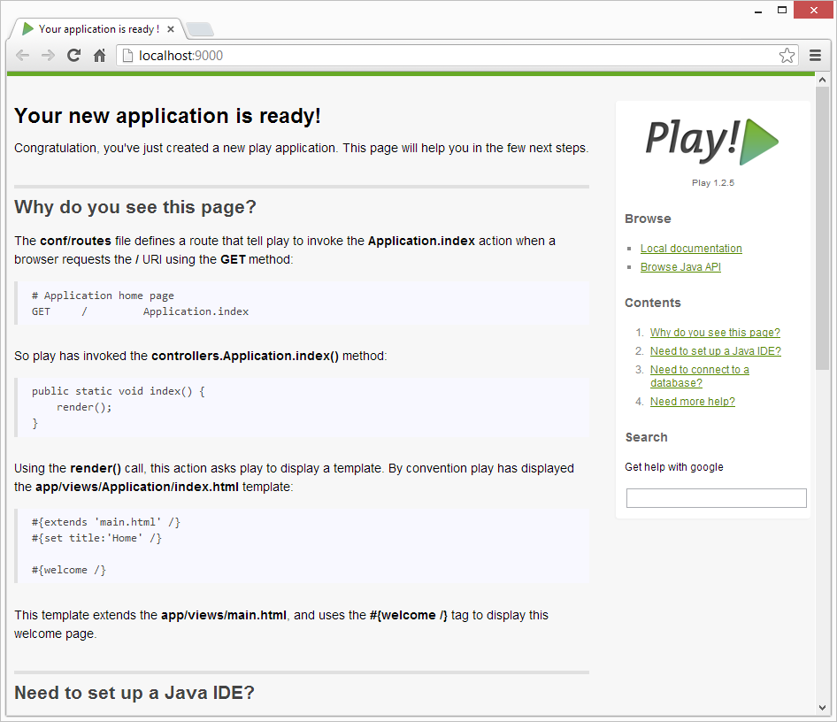

#Running a Play Application

Back in DOS, from inside the spacebook folder, type the following command:

~~~
play run
~~~

Play will respond with something like this:

~~~
~        _            _ 
~  _ __ | | __ _ _  _| |
~ | '_ \| |/ _' | || |_|
~ |  __/|_|\____|\__ (_)
~ |_|            |__/   
~
~ play! 1.4.1, http://www.playframework.org
~
~ Ctrl+C to stop
~ 
Listening for transport dt_socket at address: 8000
16:30:33,586 INFO  ~ Starting /Users/edeleastar/Dropbox/webdev/2012/dev/projects/spacebook
16:30:34,646 WARN  ~ You're running Play! in DEV mode
16:30:34,894 INFO  ~ Listening for HTTP on port 9000 (Waiting a first request to start) ...
16:30:58,912 INFO  ~ Application 'Spacebook' is now started !
~~~

You may get a dialog from the firewall, asking for permission to run, which you should agree to.

Now run the browser, and navigate to:

- <http://localhost:9000/>

you should see something like this:

Also notice that a log message will appear in the command window indicating that the app has started:

~~~
16:30:58,912 INFO  ~ Application 'Spacebook' is now started !
~~~

To stop the application, press "Control+C" in the command prompt.  If you refresh the browser window, then you should now get an error

Start the app again by typing 'play run' as above. Verify that the app has started by browsing/refreshing to:

- <http://localhost:9000/>

Try this a few times to get used to starting/stopping the application