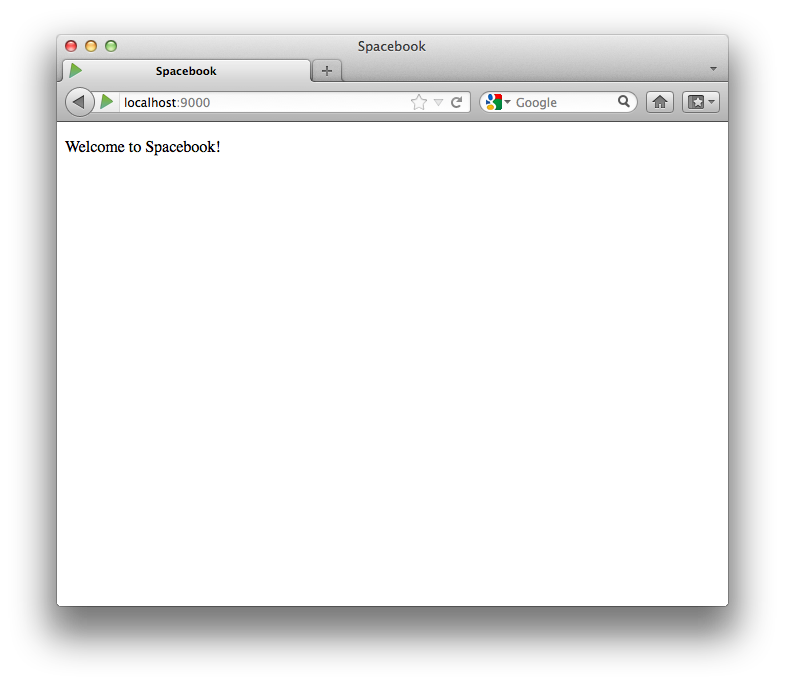

#Introducing some Content

In Eclipse, open the java class "Application.java" - which is in the 'controllers' package located within the folder app:

~~~java
package controllers;

import play.*;
import play.mvc.*;
import java.util.*;
import models.*;

public class Application extends Controller
{
  public static void index()   
  {     
  	render();   
  }
}
~~~

Now open the file 'index.html' in the 'views/Application' folder:

~~~html
#{extends 'main.html' /}
#{set title:'Home' /}

#{welcome /}
~~~

When you open this file, you may get am "Unsupported Character Encoding" message. If this happens, select 'UTF-8'.

Let us change the title to be "Spacebook", and replace the 'welcome' line with our own greeting:

~~~
#{extends 'main.html' /}
#{set title:'Spacebook' /}

  Welcome to Spacebook!

~~~

Save the file in Eclipse, and reload this page:

- <http://localhost:9000/>

which you may already be browsing.

In the browser, right click and 'view source'. Look carefully at the page source - which should be something like this:

~~~
<!DOCTYPE html>

<html>
  <head>
    <title>Spacebook</title>
    <meta charset="utf-8">
    <link rel="stylesheet" media="screen" href="/public/stylesheets/main.css">
    <link rel="shortcut icon" type="image/png" href="/public/images/favicon.png">
  </head>
  <body>     
    

      Welcome to Spacebook!
    
        
    
  </body>
</html>
~~~

This single page displayed in the browser is generated from two pages in the project

##views/main.html

~~~
<!DOCTYPE html>

<html>
  <head>
     <title>#{get 'title' /}</title>
     <meta charset="${_response_encoding}">
     <link rel="stylesheet" media="screen" href="@{'/public/stylesheets/main.css'}">
     #{get 'moreStyles' /}
     <link rel="shortcut icon" type="image/png" href="@{'/public/images/favicon.png'}">
  </head>
  <body>
    #{doLayout /}

    
    #{get 'moreScripts' /}
  </body>
</html>

~~~

and

##views/Application/index.html

~~~
#{extends 'main.html' /}
#{set title:'Spacebook' /}

  Welcome to Spacebook!

~~~

See if you can figure out how they are related. This will be a challenge for the moment, but there are certain clues - particularly the this line:

~~~
    #{doLayout /}
~~~

in main.html.
