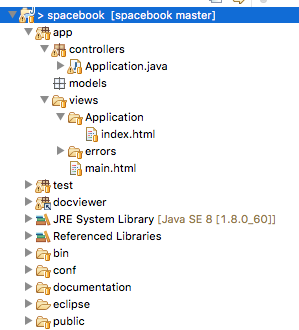
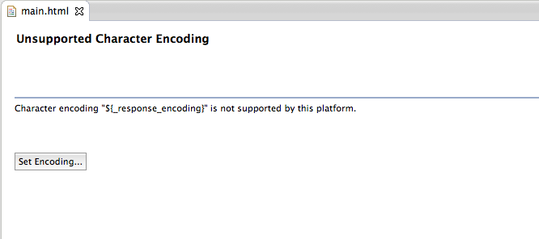
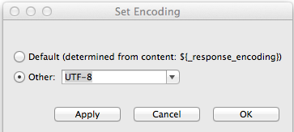
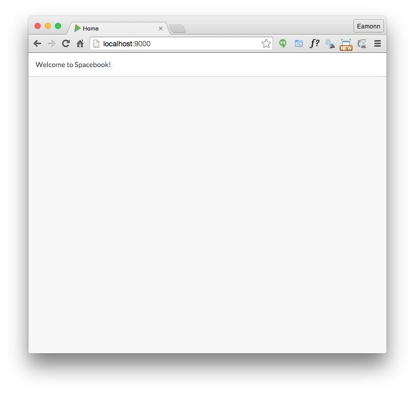
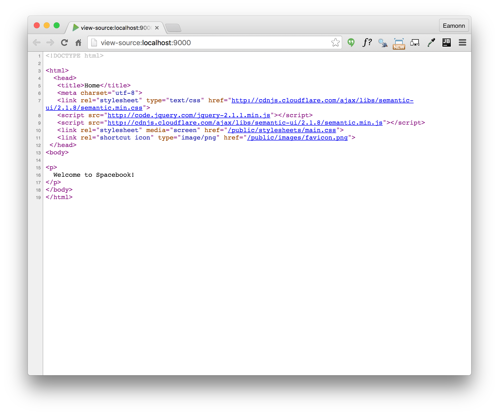

#Play Project Layout

We can start the process of making our site 'dynamic'. This means that the pages will be composed of multiple fragments, as opposed to the single 'static' pages we have been constructing to date.

Look again at our static site, as we may have left it in an earlier lab:

- [spacebook-semantic](archives/spacebook-semantic/home.html)

You Eclipse spacebook project should look like this:

Open the file 'app/views/main.html'. The first time you open this file, eclipse may have difficulty reading it, presenting this screen:

Select 'other' and then 'UTF-8' from the drop down:

main.html should now be visible:

~~~
<!DOCTYPE html>

<html>
    <head>
        <title>#{get 'title' /}</title>
        <meta charset="${_response_encoding}">
        <link rel="stylesheet" media="screen" href="@{'/public/stylesheets/main.css'}">
        #{get 'moreStyles' /}
        <link rel="shortcut icon" type="image/png" href="@{'/public/images/favicon.png'}">
    </head>
    <body>
        #{doLayout /}
        
        
        #{get 'moreScripts' /}
    </body>
</html>

~~~

Replace this complete contents with the following:

~~~
<!DOCTYPE html>
<html>
   <head>
    <title>#{get 'title' /}</title>
    <meta charset="${_response_encoding}">
    <link rel="stylesheet" type="text/css" href="http://cdnjs.cloudflare.com/ajax/libs/semantic-ui/2.1.8/semantic.min.css">
     
              
    <link rel="stylesheet" media="screen" href="@{'/public/stylesheets/main.css'}">
    <link rel="shortcut icon" type="image/png" href="@{'/public/images/favicon.png'}">
  </head>
  <body>
    <section class="ui segment">
      #{doLayout /}
    </section>
  </body>
</html>
~~~

Run the app now with this revised styling. To run a play app, we must have a command prompt running, and be 'in' the folder containing the project. Then we just type:

~~~
play run
~~~

and browse to:

- <http://localhost:9000>

To see the app in action.

While in the browser (Chrome preferably), we can switch between browsing the site - which looks like this:

and browsing the 'source. To do this, placing the mouse on the canvas, right click and select 'View Page Source'

You will be doing this occasionally during when building web apps. Compare the `<head>` of this page with the html we pasted into main.html. See if you can analyse precisely the differences. They are small and will seem very obscure (for the moment).

