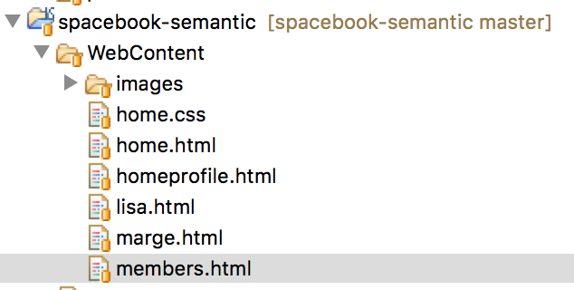
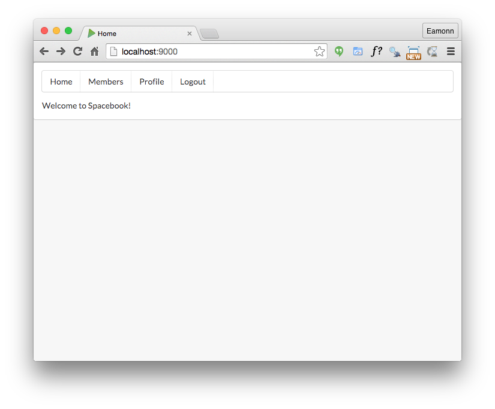
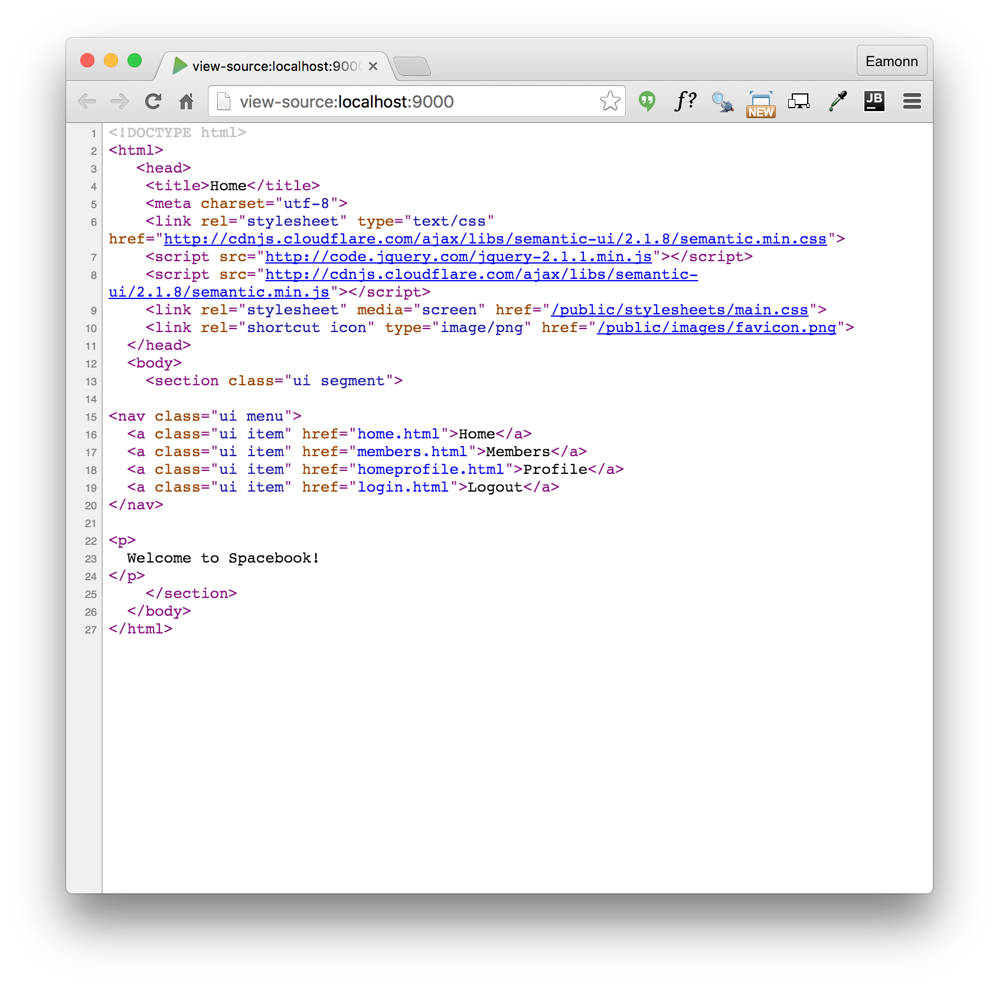
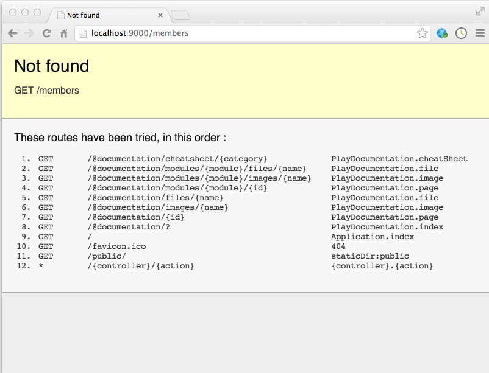

#Navbar

Reflect again on the site we have already built:

- [spacebook-semantic](archives/spacebook-semantic/home.html)

Instead of thinking of the site as a set of files on disk, currently structured thus in the 'static' project:

We take a logical view, and think of the site as something constructed out of 'parts'. These may be

- Header
- Navigation bar
- Body

Furthermore, we consider that we have several versions of the 'body', one each for:

- Home
- Members
- HomeProfile
- User Profiles for marge and lisa, and any other user

Lets start with the navbar - this is the one we used in the static version:

~~~
    <nav class="ui menu">
      <a class="ui item" href="home.html">Home</a>
      <a class="ui item" href="members.html">Members</a>
      <a class="ui item" href="homeprofile.html">Profile</a>
      <a class="ui item" href="login.html">Logout</a>
    </nav>
~~~

Now, in 'app/views/Application/index.html', include this navbar directly after the title:

~~~
#{extends 'main.html' /}
#{set title:'Home' /}

<nav class="ui menu">
  <a class="ui item" href="home.html">Home</a>
  <a class="ui item" href="members.html">Members</a>
  <a class="ui item" href="homeprofile.html">Profile</a>
  <a class="ui item" href="login.html">Logout</a>
</nav>

  Welcome to Spacebook!

~~~

Save these files and, if your app is still running, refresh the page:

- <http://localhost:9000>

Our nav bar should have appeared:

Look carefully at the 'source' (in chrome) of this page:

Try the navbar links - you will note that get an error for each of them, something like:

Will will fix these in the next step.
