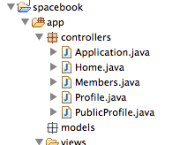
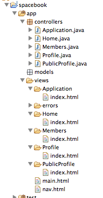
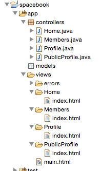

#Controller & Views

##Controllers

Review again the class 'controllers/application.java'

~~~
package controllers;

import play.*;
import play.mvc.*;

import java.util.*;

import models.*;

public class Application extends Controller
{
  public static void index()
  {
    render();
  }
}
~~~

We would like to create 4 copies of this file - each one identical, but named as follows:

- Home
- Members
- Profile
- PublicProfile

There are a number of ways of doing this. The simplest might be to select 'Application.java' in eclipse and select 'Edit->Copy', then select 'Edit-Paste'. In the ensuing dialog, enter one of the names above (including the capitalisation). If this goes according to plan, you might have a project looking like this:

##Views

Now we look at the view : `views/Applications/index.html`:

~~~html
#{extends 'main.html' /}
#{set title:'Spacebook' /}

<nav class="ui menu">
  <a class="ui item" href="home.html">Home</a>
  <a class="ui item" href="members.html">Members</a>
  <a class="ui item" href="homeprofile.html">Profile</a>
  <a class="ui item" href="login.html">Logout</a>
</nav>

  Welcome to Spacebook!

~~~

We need to make an important adjustment to this view - change the `<nav>` element to look like this:

~~~html
<nav class="ui menu">
  <a class="ui item" href="/home">Home</a>
  <a class="ui item" href="/members">Members</a>
  <a class="ui item" href="/profile">Profile</a>
  <a class="ui item" href="/login">Logout</a>
</nav>
~~~

(Note the changes to the href attribute)

We would now like to do the same for the 'views/Application/index.html' file. i.e. create 4 folders named

- Home
- Members
- Profile
- PublicProfile

.. again, each folder containing a file called 'index.html'. You could use the same technique as above (Edit/Copy - Edit/Paste). Your project should be looking like this:

Finally, delete the Application controller + Application view folder - leaving you application like this:

