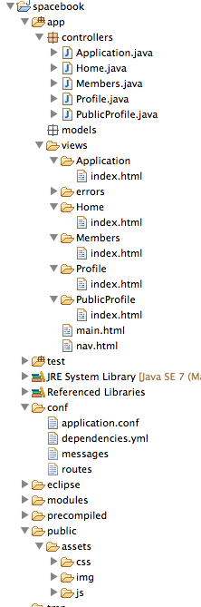
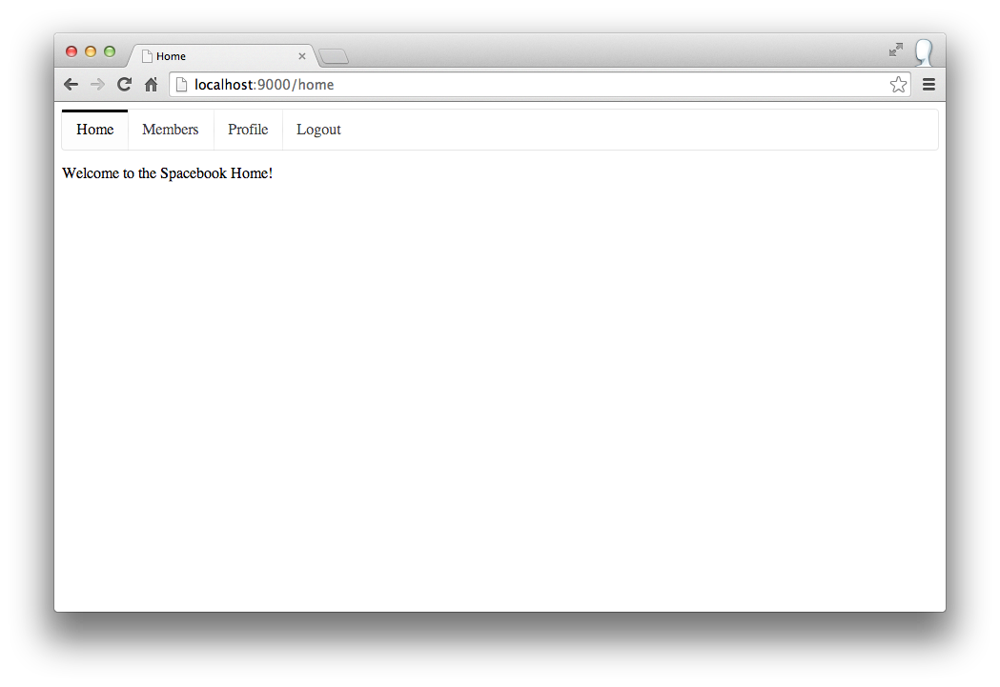

#Running the App

Your project should still look like this:

Run the app from the command line as before. I.e. in the Command Prompt, navigate to the folder containing the project and enter:

~~~
play run
~        _            _ 
~  _ __ | | __ _ _  _| |
~ | '_ \| |/ _' | || |_|
~ |  __/|_|\____|\__ (_)
~ |_|            |__/   
~
~ play! 1.3.0, http://www.playframework.org
~
~ Ctrl+C to stop
~ 
Listening for transport dt_socket at address: 8000
08:02:40,017 INFO  ~ Starting /Users/edeleastar/dev/webdevws/spacebook
08:02:40,847 WARN  ~ You're running Play! in DEV mode
08:02:40,959 INFO  ~ Listening for HTTP on port 9000 (Waiting a first request to start) ...
~~~

Browse to: 

- <http://localhost:9000/> 

and the application should appear:

Verify that by selecting any of the tabs, a different message appears on each page. 

