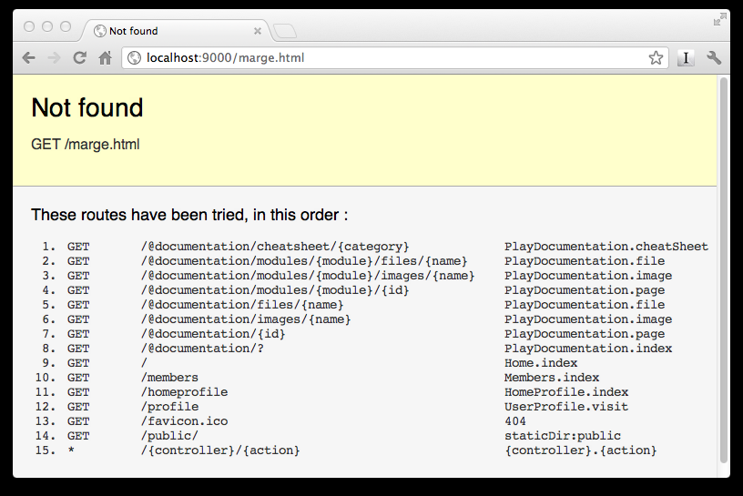
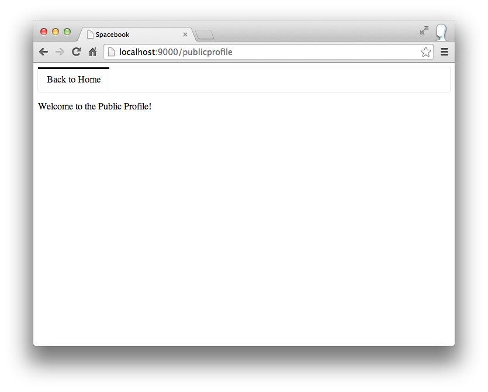
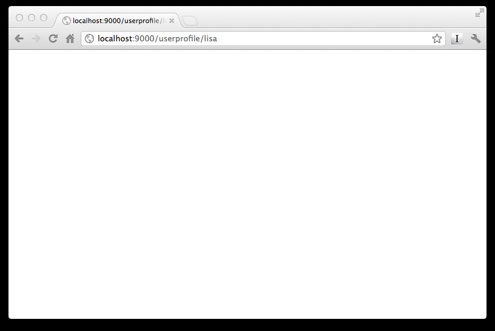

#Links to User Profiles

Returning to the home page, notice that homer has 2 friends, Marge and Lisa. Selecting either of these generates an error:

These links are generated by these html elements in 'views/Home/index.html':

~~~html
...
  <a href="marge.html">marge</a>, (<a href="drop/marge">drop</a>)
...
  <a href="lisa.html">lisa</a>, (<a href="drop/lisa">drop</a>)
...
~~~

We would like to changes these links such that they load a page. We do this by having them call a method in one of the controllers, and have that controller then 'render' the page.

Change above elements to the following:

~~~html
...
  <a href="/publicprofile">marge</a>, (<a href="drop/marge">drop</a>)
...
  <a href="/publicprofile">lisa</a>, (<a href="drop/lisa">drop</a>)
...
~~~

For this to work, we need to make sure the file 'conf/routes' is properly configured. Edit this now and make sure it contains the following entry:

~~~
# Public Profiles
GET     /publicprofile                          PublicProfile.index
~~~

Place this after the "Profile page" entry.

Make sure the the view/PublicProfile/index.html contains the following:

~~~html
#{extends 'main.html' /}
#{set title:'Spacebook' /}

<nav class="ui menu">   
  <a class="ui active item" href="/home">Back to Home</a> 
</nav>

  Welcome to the Public Profile!

~~~

Make sure to save all files in Eclipse, browse to the site and select 'marge' or 'lisa' from the home page. What do you see? The error should be gone, and you should have something like this:

Note carefully the url in the address bar.

The same page is being displayed for both users, we would like to change this, such that we at least get a message indicating which user we are visiting. First lets change the urls in the views/Home/index.html page, this time we extend the url to indicate that we want to 'visit' a specific users page:

~~~html
...
   <a href="/publicprofile/marge">marge</a>, (<a href="drop/marge">drop</a>)
...
   <a href="/publicprofile/lisa">lisa</a>, (<a href="drop/lisa">drop</a>)
...
~~~

Save this page in eclipse, and refresh the browser. Try to click on one of the links - 'marge' or 'lisa'. You will get the same error you may have seen previously.

This is a 'routing error' - that is a url has arrived at your app that it cannot recognize. These errors are usually a result of a mismatch in the 'conf/routes' file. Make the following changes to it:

First, delete this line (the one we have just entered):

~~~
GET     /publicprofile                           PublicProfile.index
~~~

... and replace it with this entry:

~~~
GET     /publicprofile/{name}                   PublicProfile.visit
~~~

Save everything and restart the Play application. To restart the application, enter `Control-C` in the console running the play application, and enter `play run` again start it.

Try to visit marge's page again. We should still have the routing error. Specifically, note that it says:

~~~
UserProfile.visit action not found
~~~

Now, put an empty visit method into the controllers/UserProfile class:

~~~java
public class PublicProfile extends Controller
{
  public static void index()
  {
    render();
  }
  
  public static void visit(String name)
  {
  }  
}
~~~

Save everything and reload - this time you should get a blank page:

Reflect again on these three fragments:

~~~html
 <a href="/publicprofile/marge">marge</a>, (<a href="drop/marge">drop</a>)
~~~

~~~
GET     /publicprofile/{name}                   PublicProfile.visit
~~~

~~~java
  public static void visit(String name)
  {
  }  
~~~

Can you see how they are related? In the next step we will try to have some content displayed on these blank pages
