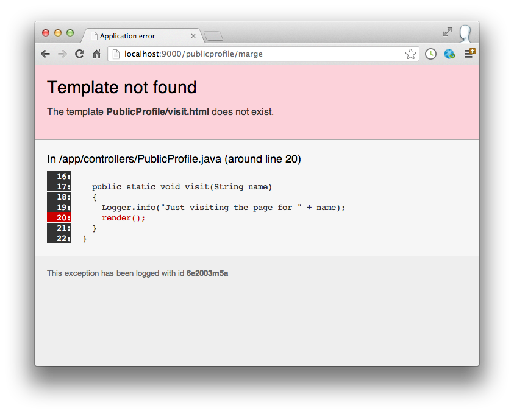
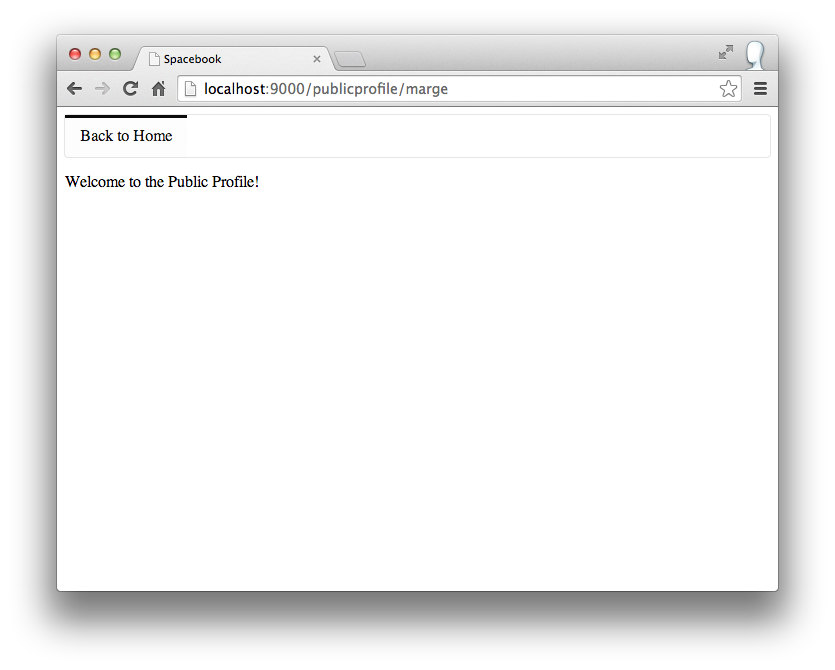

#Public Profile I

We have just made the following changes:

~~~html
...
   <a href="/publicprofile/marge">marge</a>, (<a href="drop/marge">drop</a>)
...
   <a href="/publicprofile/lisa">lisa</a>, (<a href="drop/lisa">drop</a>)
...
~~~

~~~
# Public Profiles
GET     /publicprofile/{name}                   PublicProfile.visit
~~~

~~~java
  public static void visit(String name)
  {
  }  
~~~

and browsing to 

- <http://localhost:9000/publicprofile/lisa> 

takes us to a blank page. How do we know if the name of the user got through? We can 'log' the call via a simple statement in the visit method:

~~~java
  public static void visit(String name)
  {
    Logger.info("Just visiting the page for " + name);
  }
~~~

Save and refresh. The page will still be blank - but have a look at our 'console' - i.e. the command prompt from which you initially ran the app:

~~~
11:00:49,877 INFO  ~ Just visiting the page for lisa
~~~

This is where the output of any log messages go - useful for debugging your app.

Our page is still blank however. We can fix this with the following change:

~~~java
  public static void visit(String name)
  {
    Logger.info("Just visiting the page for " + name);
    render();
  }
~~~

We are calling 'render()'

Try this now. You will get an error something like this:

Read the error message carefully - it is attempting to display a file called 'visit.html' from the PublicProfile folder. Back in eclipse, rename the index.html file in PublicProfile to 'visit.html'. (Rename option is available via the `Refactor` menu in Eclipse).

Save everything, and try to visit marge or lisa's page again. You should get this:

To recap, we introduced a call to a render() method in the UserProfile.visit() function:

~~~java
  public static void visit(String name)
  {
    Logger.info("Just visiting the page for " + name);
    render();
  }
~~~

And then we made sure there was a file called 'visit.html' in the views/PublicProfile folder.

