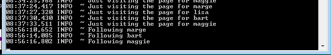

#Exercises: 

Archive of lab so far:

- [spacebook-part-1.zip](archives/spacebook-part-1.zip)

##Exercise 1

Currently marge and lisa appear on the home page as 'friends'. Add bart and maggie. Make sure that, when visiting the pages, the correct images appear.

##Exercise 2

Visit the members page - which shows a list of members + a 'follow' link. This is the source of members/index.html here:

~~~html
...
<section class="ui segment">
  <h2 class="ui header">SpaceBook's Members</h2>
  

    

      <i class="right triangle icon"></i> 
      

        marge [<a href="home.html">follow</a>]
      

    

    

      <i class="right triangle icon"></i> 
      

        bart [<a href="home.html">follow</a>]
      

    

    

      <i class="right triangle icon"></i> 
      

        lisa [<a href="home.html">follow</a>]
      

    

    

      <i class="right triangle icon"></i> 
      

        maggie [<a href="home.html">follow</a>]
      

    

  

</section>
~~~

Note that each of the follow links is incorrect, and should give you a routing error (try them).  Using Step 5 as a guide, implement links in the above such that whenever the 'follow' link is selected, we log to the console the name of the member we want to follow. 

Eg - the Terminal/Command prompt might show:

This will require that you create a new method in Java, and implement a call to the logger (as in step 5)
. 
NB: This exercise will also require a changes to the 'conf/routes' file. Specifically, you will need to introduce a new route to support the follow method, very similar to the 'visit' route we have implemented earlier

##Exercise 3

If you get Exercise 3 working, then turn your attention back to the list of friends on the home page.

What should the 'drop' link do? Implement something similar to the last exercise: i.e. have pressing 'drop' log a message to the console. 

Do this as follows:

- Create a method in Home class called "drop"
- have this method take a single string as a parameter, which it should log to the console
- a route should be set up in conf/routes to 'map' this route
- home/index.html will need to be changed to generate the correct link.

If all goes according to plan, clicking on the links should cause log message to appear. However, the user interface may take you to a blank page each time. Can you change this? Try calling "index();" in the drop method. 

Can you explain what is happening?
