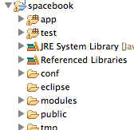
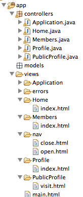
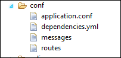
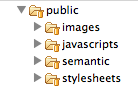

#Review the project structure

##Lab07 Project

You should have a project from last weeks lab. If you dont have the project then this is a version (before the exercises) here

- [spacebook-part-1.zip](archives/spacebook-part-1.zip)

Download and unzip this project - it is called 'spacebook-part-1' - to distinguish it from your project which should be called 'spacebook'. If you wish to just view the source, and run the application - import it into your workspace in eclipse.

It is important to become extremely familiar with the structure of the project. It can be a little confusing at first, but it is in fact laid out in a very logical manner. At the highest level, the project looks like this:

There are three folder in the project we are most interested in.

##app

##conf

##public

Examine these files in your project, and verify that everything is as shown above. We can ignore the others folders for the moment
