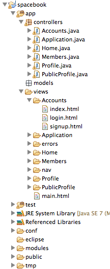

#Signup, Login & Logout Templates

Our application does not currently support certain critical features:

- Signing up to the service
- Logging in with username/password
- Logging out

We might call this feature 'Account Management'. This would support a number of screens:

- A screen to ask the user if they want to sign up or log in
- A sign up screen
- A log in screen

We will provide all of the above via a new class we will call 'Accounts'. In the 'App/controllers' folder, create an empty java class called 'Accounts' - and incorporate the following skeleton:

~~~java
package controllers;

import play.*;
import play.mvc.*;
import java.util.*;
import models.*;

public class Accounts extends Controller
{

}
~~~

We would like to 'render' different views depending on the context. Introduce the following methods inside the class to realise this:

~~~java
  public static void signup()
  {
    render();
  }

  public static void login()
  {
    render();
  }

  public static void logout()
  {
    index();
  }

  public static void index()
  {
    render();
  }
~~~

Look carefully at this simple class. For every call to 'render()', we need a corresponding html file in views named as follows

- views
    - class name
        - method name.html

For this example, we thus need 

- views
    - Accounts
        - signup.html
        - login.html
        - index.html
    
(we dont need logout.html - as it does not call render(), it calls index() instead). Create these files now, inside a new folder called Accounts in the views folder. Provide some initial content:

##index.html

~~~html
#{extends 'main.html' /}
#{set title:'Welcome to Spacebook' /}

<nav class="ui menu">
  <a class="item" href="/signup"> Signup  </a>
  <a class="item" href="/login">  Login   </a>
</nav> 
  
<section class="ui segment">
  
 Signup or Log in to the Spacebook Service 

</section>

~~~

##signup.html

~~~html
#{extends 'main.html' /}
#{set title:'Signup for Spacebook' /}

<nav class="ui menu">
  <a class="active item" href="/signup"> Signup  </a>
  <a class="item" href="/login">  Login   </a>
</nav> 

<section class="ui segment">
  
 Sign up here ... 

</section>
~~~

##login.html

~~~html
#{extends 'main.html' /}
#{set title:'Login to Spacebook' /}

<nav class="ui menu">
  <a class="item" href="/signup"> Signup  </a>
  <a class="active item" href="/login"> Login  </a>
</nav> 

<section class="ui segment">
  
 Log in here ... 

</section>
~~~

Your workspace will start to look like this:

Before we can test it out, we need to set up the appropriate routes. Edit 'conf/routes', and introduce the
following entries:

~~~
# Landing page
GET    /                                        Accounts.index

# Accounts

GET    /signup                                  Accounts.signup
GET    /login                                   Accounts.login
GET    /logout                                  Accounts.logout

# Home page
GET    /home                                    Home.index
~~~

Note that we have also changed '/' (Home.index) entry - such that '/home' will now load the home page.

Run play locally now, and browse to the home page

- <http://localhost:9000/>

Try the nav bar links, and also each of the following urls directly:

- <http://localhost:9000/signup>
- <http://localhost:9000/login>
- <http://localhost:9000/logout>

Can you explain what is happening? Essentially, our routes file is intercepting these urls and directing them to the Accounts class - and calling each of the methods above. These methods are in turn rendering different pages, each with a different title.

Also try these links:

- <http://localhost:9000/home>
- <http://localhost:9000/members>
- <http://localhost:9000/profile>

