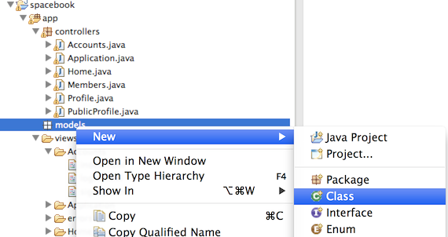
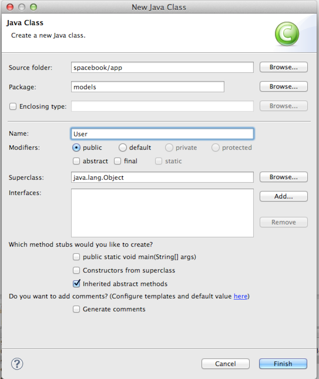

#User Model

In Eclipse, select the 'models' package (in 'app'), right click, and select 'new->class' as shown here: 

Call the class 'User', and accept the defaults:

Replace the generated stubb class with the following (completely replace all contents):

~~~java
package models;

import javax.persistence.Entity;

import play.db.jpa.Model;

@Entity
public class User extends Model
{
  public String firstName;
  public String lastName;
  public String email;
  public String password;
  
  public User(String firstName, String lastName, String email, String password)
  {
    this.firstName = firstName;
    this.lastName  = lastName;
    this.email     = email;
    this.password  = password;
  }
}
~~~

This is a 'model' class, which will be used to store information in a database. In order to start using a database, we need to tell our framework what database to use. In eclipse, open the file 'conf/application.conf, and locate the following entries:

~~~
# Enable a database engine if needed.
#
# To quickly set up a development database, use either:
#   - mem : for a transient in memory database (H2 in memory)
#   - fs  : for a simple file written database (H2 file stored)
# db.default=mem
#
# T
~~~

Uncomment (i.e. remove the leading '#' character) the 'db=mem' line:

~~~
db.default=mem
~~~

Now in our Accounts.register() method, do two important things:

- Create a new User object to represent a new user
- Save this object in the database.

This is accomplished as follows:

~~~java
  public static void register(String firstName, String lastName, String email, String password)
  {
    Logger.info(firstName + " " + lastName + " " + email + " " + password);
    
    User user = new User (firstName, lastName, email, password);
    user.save();
    
    index();
  }
~~~

Restart the application - this is necessary because we have changed an important database configuration parameter. Browse to the form again and fill in the form. Verify that there are no errors when you press signup.

