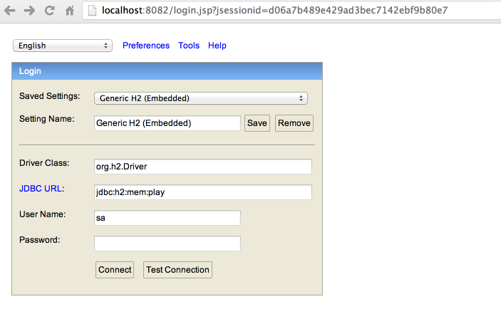
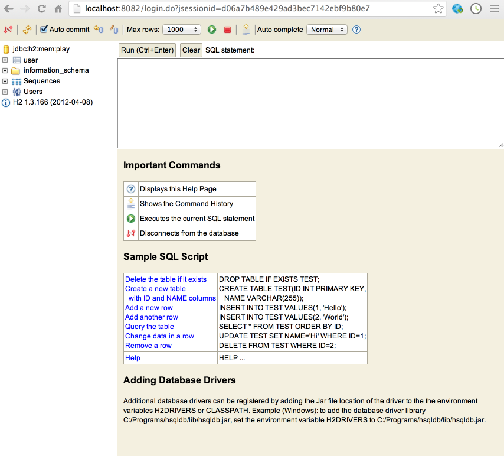
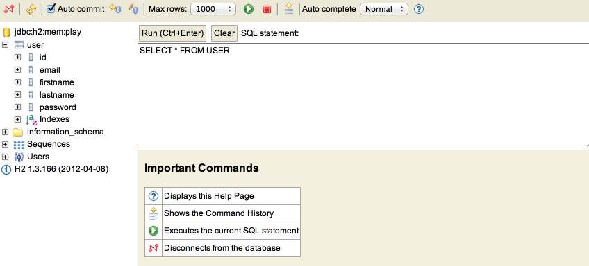
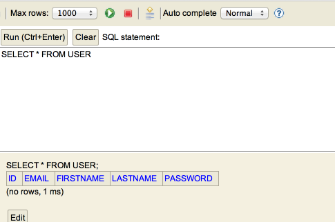
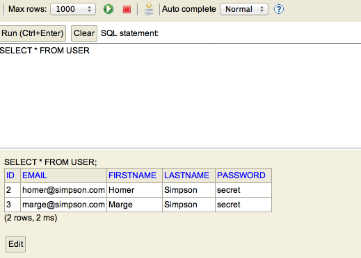
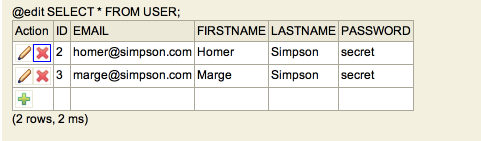
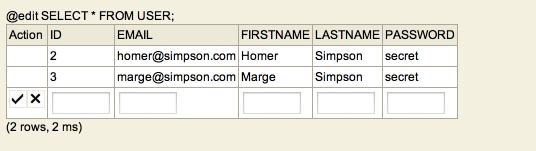

#Database Browsing

From the last step we note that when a someone fills out the form and presses 'sign up' then ultimately this method here is called:

~~~java
  public static void register(String firstName, String lastName, String email, String password)
  {
    Logger.info(firstName + " " + lastName + " " + email + " " + password);

    User user = new User (firstName, lastName, email, password);
    user.save();

    index();
  }
~~~

Where does 'user.save()' put the user details? It goes to a database - and in this step we will take a peak inside the database to have have a look at the entries. This will be useful for debugging, as we would like to be able to verify what is happening with any data we save.

With your application running, browse to this url:

- <http://localhost:9000/@db>

You should see this screen here:

Before pressing 'connect', make sure the 'JDBC URL' field contains the following:

~~~
jdbc:h2:mem:play
~~~

Press 'connect' and you should see this:

This is a peek into the database your application is using. We will look at this occasionally to see what is going on, but it is not part of our applications user interface as such.

You can see our 'user' is already in there. Select it and its structure should be visible:

Press the green 'Run' button:

This has executed a query - and the table is shown below. If you have registered someone, it will appear in the report after you have pressed the 'run' button. Register some users now and see if they appear:

Note that by pressing the 'edit' button, we can delete entries:

Or add new ones:

Experiment with adding/removing some entries, using both or application and this console.
