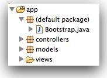

#Exercises

- [spacebook-part-3.zip](archives/spacebook-part-3.zip)

##Exercise 1

Change the Profile controller/view to display the currently logged in users full name (not just the first name).

##Exercise 2

In the user Profile view, see if you can figure out how to let the user see his/her  email. 

##Exercise 3

Start the application from scratch.  Browse to the database administrator:

- <http://localhost:9000/@db>

Use this user interface to create some users. Then see if you can log in with these users using the regular interface:

- <http://localhost:9000>

Use the MySqlWorkbench to do the same.

##Exercise 4

Currently, every time we stop the application our database is cleared - and when we run again we have to register new users again. This can get tiresome and repetitive. Our framework comes with a simple mechanism for pre-loading our database if we want to hit the ground running with initial test data.

Create a file called 'data.yml' in the conf directory in the project, and incorporate the following contents into it:

~~~
User(homer):
    firstName: Homer
    lastName: Simpson
    email: homer@simpson.com
    password: secret
    
User(marge):
    firstName: Marge
    lastName: Simpson
    email: marge@simpson.com
    password: secret
~~~

Now create a new java class called 'Bootstrap' - directly in the the 'app' folder in your eclipse project. The class is to contain the following:

~~~java
import java.util.List;

import play.*;
import play.jobs.*;
import play.test.*;
 
import models.*;
 
@OnApplicationStart
public class Bootstrap extends Job 
{ 
  public void doJob()
  {
    if (User.count() == 0)
    {
      Fixtures.loadModels("data.yml");
    }
  }
}
~~~

This last step can be tricky - as you may get warnings from Eclipse saying it does not like classes in here (it prefers them in packages). If it works correctly, it will appear like this in your workspace:

Stop the application and start it again. Go directly to the database admin page

- <http://localhost:9000/@db>

...and see if the users we specified are there. See if you can log in without registering.

Add a few more users and see if they appear as expected (you will have to stop and restart the application for this to take effect).

