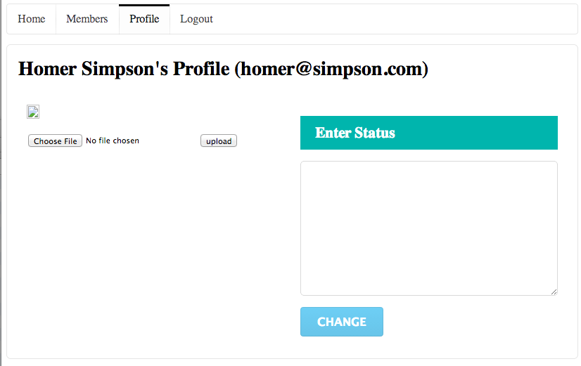

#Saving to the Database

If you log in to this user here:

- username 'homer@simpson.com'
- password 'secret'

and visit the 'profile' page, you should see a screen something like this:

Reflect again an the code behind this. 

The `model` class User:

~~~java
@Entity
public class User extends Model
{
  public String firstName;
  public String lastName;
  public String email;
  public String password;
  
  public User(String firstName, String lastName, String email, String password)
  {
    this.firstName = firstName;
    this.lastName = lastName;
    this.email = email;
    this.password = password;
  }
  
  public static User findByEmail(String email)
  {
    return find("email", email).first();
  }

  public boolean checkPassword(String password)
  {
    return this.password.equals(password);
  }
}
~~~

The `controller` class Profile

~~~java
public class Profile extends Controller
{
  public static void index()
  {
    String userId = session.get("logged_in_userid");
    User user = User.findById(Long.parseLong(userId));
    render(user);
  }
  
  public static void changeStatus()
  {
    Logger.info("Status changed");
    index();
  }
}
~~~

and the corresponding view:

~~~html
#{extends 'main.html' /}
#{set title:'Profile' /}

<nav class="ui menu"> 
  <a class="ui item" href="/home">Home</a>      
  <a class="ui item" href="/members">Members</a>   
  <a class="ui active item" href="/profile">Profile</a>   
  <a class="ui item" href="/login">Logout</a>      
</nav>

<section class="ui segment">
  <h2 class="ui header">${user.firstName} ${user.lastName}'s Profile (${user.email})</h2>
  

    

      

        

          
        

        <form action="homeprofile/upload" method="post" enctype="multipart/form-data">
          <input type="file" name="userfile" value="" /> <input type="submit" name="submit" value="upload" />
        </form>
      

      

        <form action="/profile/changestatus" method="post">
          <h3 class="ui inverted teal block header">Enter Status</h3>
          <textarea class="ui field" name="profiletext"> </textarea>
          <input class="ui blue button" type="submit" name="submit" value="Change" />
        </form>
      

    

  

</section>
~~~

Locate these in eclipse now. We would like to extend this such that, if the user types something into the edit field, and presses 'change' - then the text entered will appear, just under the 'Status Text' header.

This will require four changes to our app. 

##Change 1

First, we create a new member in the 'User' class to store the text - we will call it 'statusText'

~~~java
public class User extends Model
{ 
  //...
  public String statusText;
  //...
}
~~~

###Change 2

Make sure that there is a 'route' that maps the pressing of the change button to a method we will call 'changeText' in the HomeProfile class. This is via this new entry in the 'conf/routes' file:

~~~
POST    /profile/changestatus                   Profile.changeStatus
~~~

(We already did this in an earlier lab)

###Change 3

Replace the changeStatus method in the Profile controller class with the following version:

~~~
  public static void changeStatus(String profiletext)
  {
    String userId = session.get("logged_in_userid");
    User user = User.findById(Long.parseLong(userId));
    user.statusText = profiletext;
    user.save();
    Logger.info("Status changed to " + profiletext);
    index();
  } 
~~~

Looking at the above method, we are doing the following:

- determining who is currently logged in
- reading the details about that user from the database into the user object
- replacing the current status with the new status the user has just entered
- saving this to the database
- printing a log message
- redrawing the screen

##Change 4

In the  Profile/index.html file, we will display the updated status text. Locate the second column here:

~~~html
      

        <form action="/profile/changestatus" method="post">
          <h3 class="ui inverted teal block header">Enter Status</h3>
          <textarea class="ui field" name="profiletext"> </textarea>
          <input class="ui blue button" type="submit" name="submit" value="Change" />
        </form>
      

~~~

and we insert new elements above the form to display the status for the user:

~~~html
      

        <h2 class="ui small header"> Status</h2>
        

          
 ${user.statusText} 

        

        

        <form action="/profile/changestatus" method="post">
          <h3 class="ui inverted teal block header">Enter Status</h3>
          <textarea class="ui field" name="profiletext"> </textarea>
          <input class="ui blue button" type="submit" name="submit" value="Change" />
        </form>
      

~~~

Save all files in eclipse, and refresh the home profile page. Entering some text, pressing 'change', should cause the new message to be displayed above the email. Log out and log back in again. Verify that the status text 'persists' i.e. is the same as you left it before logging out.

