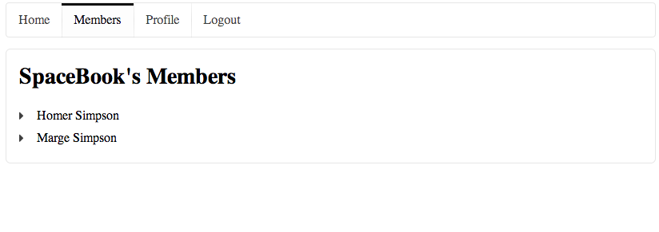
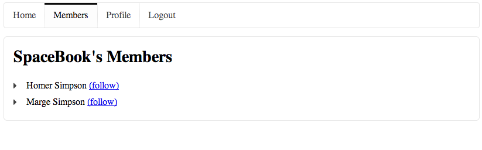

#Following Members

Currently, our members page looks like this:

We would like it to look like this:

This is achieved by extending the list items in 'Views/members/index.html' with this element:

~~~html
  <a href="/members/follow/${user.id}"> (follow) </a>
~~~

Notice how the link appears in brackets after the users name, and refers to this route here:

~~~
  href="/members/follow/${user.id}"
~~~

Can you figure our what is going on here? If you go back to the browser, and hover over the 'follow' links, you will see how the link is actually expanded with the user ids of each user inserted into each link. To see this, save everything in Eclipse, reload the browser, and hover over each of the 'follow' links in turn:

We need a 'route' in the 'conf/routes' files that maps this url:

~~~
GET     /members/follow/{id}                  Members.follow
~~~

And we need a method in the Members controller to implement this route:

~~~Java
  public static void follow(Long id)
  {
    Logger.info("Following " + id);
    index();
  }
~~~

Run the app now, and keep an eye on the console, you should see the IDs being 'followed' as expected.

Finally, we can use the id to lookup the users name, and log the name to the console. This a new version of follow():

~~~Java
  public static void follow(Long id)
  {
    User userToFollow = User.findById(id);
    Logger.info("Following " + userToFollow.firstName);
    index();
  }
~~~

Run this now, you should see the users first name logged.