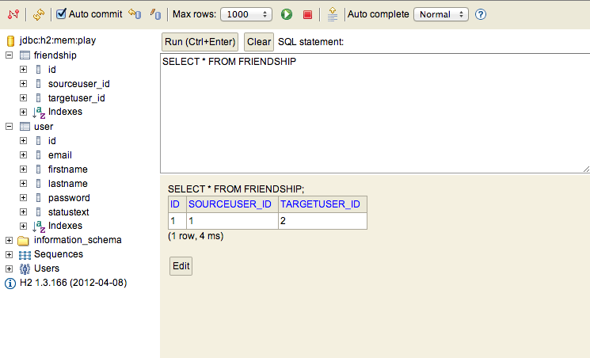

#Saving Friendship List

We now have a mechanism whereby we can 'follow' another member. However, we would like to save this relationship to the database, so that we can list the members we are following on our home page. 

In the models package, create new class called `Friendship`:

~~~java
package models;

import javax.persistence.*;
import play.db.jpa.Model;

@Entity
public class Friendship extends Model
{
  @ManyToOne()
  public User sourceUser;

  @ManyToOne()
  public User targetUser;

  public Friendship(User source, User target)
  {
    sourceUser = source;
    targetUser = target;
  }
}
~~~

This models a relationship between two users - a user who initiated the friendship (sourceUser) and the user he befriended (targerUser)

In order to save the list of followers, we need to establish a collection of these `Friendship` objects, and store this collection in our User class. Make the following changes to User.java.

##Import the appropriate libraries:

Place these import statements alongside the other import statement at the top of the User.java class:

~~~java
import java.util.List;
import java.util.ArrayList;
import javax.persistence.OneToMany;
~~~

##Introduce the 'friendships' Collection:

Place this declaration in the User class, after the existing attributes:

~~~java
  //...
  public String password;
  public String statusText;

  @OneToMany(mappedBy = "sourceUser")
  public List<Friendship> friendships = new ArrayList<Friendship>();
  
  public User(String firstName, String lastName, String email, String password)
  {
  //...
~~~

We also equip the User model class with two additional methods which will maintain this relationship:

~~~java
  public void befriend(User friend)
  {
    Friendship friendship = new Friendship(this, friend);
    friendships.add(friendship);
    friendship.save();
    save();
  }

  public void unfriend(User friend)
  {
    Friendship thisFriendship = null;
    
    for (Friendship friendship:friendships)
    {
      if (friendship.targetUser== friend)
      {
        thisFriendship = friendship;
      }
    }
    friendships.remove(thisFriendship);
    thisFriendship.delete();
    save();
  }
~~~

#Save new Users in the Collection:

Back in the Members class, extend the 'follow' method to uses these new features of the User model:

~~~java
  public static void follow(Long id)
  {
    User friend = User.findById(id);
    
    String userId = session.get("logged_in_userid");
    User me = User.findById(Long.parseLong(userId));
    
    me.befriend(friend);
    index();
  }
~~~

Because we have made a change to the database, we will need to completely restart the application again. i.e. Ctrl-C in the command prompt, and enter `play run` again.

Log in to spacebook as Homer, and see if you can 'Follow' marge. Although the UI doesnt show any signs of the friendship having been established, you should be able to see it by browsing the database:

- <localhost:9000/@db>

