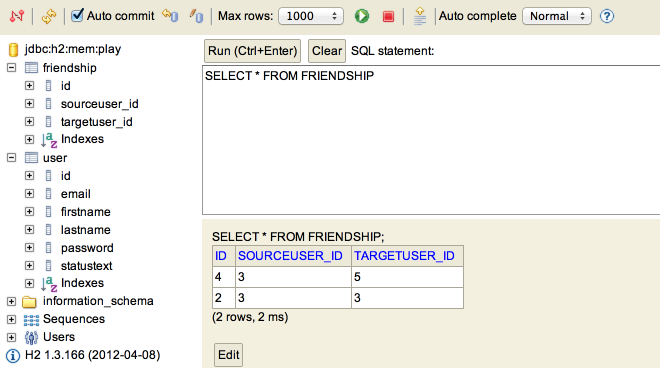

#Exercises

##Archive of lab so far:

- [spacebook-part-4.zip](archives/spacebook-part-4.zip)

##Exercise 1

Currently, when you follow a member there is not obvious change on the screen. i.e. you remain on the members page. 

~~~java
  public static void follow(Long id)
  {
    User userToFollow = User.findById(id);
    
    String userId = session.get("logged_in_userid");
    User user = User.findById(Long.parseLong(userId));
    
    user.following.add(userToFollow);
    user.save();

    index();
  }
~~~

Change this such that when you follow a member, the home page is displayed immediately - where the new entry in the 'following' list should appear. Hint: You will have to call the index() method on the Home class (instead of the Members class as currently)

##Exercise 2

Is there a way we can display the number of friends we have on the home screen - perhaps in brackets after the 'Friends' text.

Recall that we are accessing the followers list in the 'home/index.html' view:

~~~html
    <h4>Friends</h4>
    <ul> 
      #{list items:user.friendships, as:'friendship'}
        <li> 
          ${friendship.targetUser.firstName} ${friendship.targetUser.lastName} (<a href="/home/drop/${friendship.targetUser.id}"> drop </a>)
        </li>
      #{/list}
    </ul> 
~~~

'user.friends' is the list friends, and 'user.friends.size()' will retrieve the number of entries in this list. In order to use this in a html element, you would need to surround it with `${...}`, as in: '`${user.friends.size()}`

##Exercise 3

Explore the database admin interface again:

- <http://localhost:9000/@db>

In particular, look at how the friendship list is represented:

See if you can figure out how you can use this interface to make changes to the friends list, and verify that these changes appear on the home page. In particular, see if you can have two browser windows open - one with a logged in user, and one with the db interface. Make changes on the db, and see if a refresh on the logged in home page occurs immediately (after pressing refresh).

