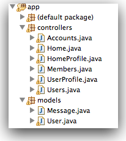

#Message Model

The first of the last two features we will tackle will be messages. This is interesting, as it will require a new model class to store messages + mechanisms for leaving and retrieving messages. We start with the model - we need a new class to represent individual messages. This is a 'Model' class, and will live in the model package - alongside our only other model class so far, User.

To create this model, select the `models` package in eclipse, right click, and select the 'New->Class', ccall the class 'Message'. This should create a new class on your 'models' package:

The class will be empty:

~~~java
package models;

public class Message
{

}
~~~

Instances of this class will hold individual messages, sent from one user to another. Each message is just a simple string - we can introduce it now as a member of the class - we will call it 'messageText':

~~~java
public class Message extends Model
{
  public String messageText;
  //...
}
~~~

We also need to know who sent the message, and whom it is intended for. These can also me modeled as class members

~~~java
public class Message extends Model
{
  public String messageText;
  public User   from;
  public User   to;
  //...
}
~~~

To make creating instances of Message more convenient, we can introduce a constructor, which will initialise the members we have just introduced:

~~~java
public class Message extends Model
{
  public String messageText;
  public User   from;
  public User   to;

  public Message(User from, User to, String messageText)
  {
    this.from = from;
    this.to = to;
    this.messageText = messageText;
  }
}
~~~

This simple class is functionally complete, however there is one more step required. We would like instances of the class to persist to a database - i.e. be saved somewhere whenever we log out, so that they can be restored when the next user logs in. There are may ways of doing this, we are going to use a mechanism called 'JPA'. 

Just after the 'package models;' statement at the top of the file, introduce the necessary import statements to make the JPA mechanisms available:

~~~java
import javax.persistence.*;
import play.db.jpa.*;
~~~

Now we will need to 'annotate' the class, essentially 'marking' specific parts of the class such that the JPA libraries will be able to 'persist' the class effectively. Here is the complete class (including the annotations):

~~~java
package models;

import javax.persistence.*;
import play.db.jpa.*;

@Entity
public class Message extends Model
{
  public String messageText;

  @ManyToOne
  public User from;

  @ManyToOne
  public User to;

  public Message(User from, User to, String messageText)
  {
    this.from = from;
    this.to = to;
    this.messageText = messageText;
  }
}
~~~

- @Entity: This indicates that the entire class will be saved to a database
- @ManyToOne: This indicates that the attirbute immediately following is another entity (also persisted), and that there may be many messages associated with that entity.

Once we have defined messages, we new establish relationships from the User to this class. One approach would be to model the notion of an 'inbox' and 'outbox' - i.e. the list of messages a user has sent, or has received.

Introduce the following two new attributes into the User model:

~~~java
  @OneToMany(mappedBy = "to")
  public List<Message> inbox = new ArrayList<Message>();
  
  @OneToMany(mappedBy = "from")
  public List<Message> outbox = new ArrayList<Message>();
~~~

You should be able to make sense of these now.