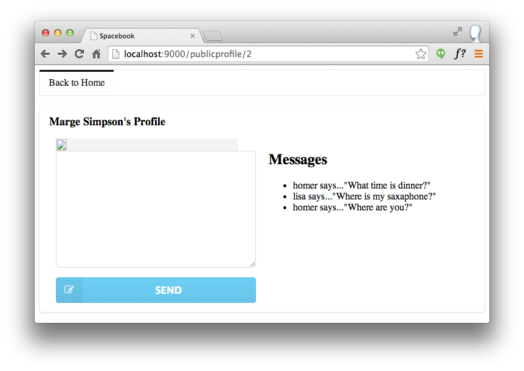

#sendMessage action I

It should be possible to leave Messages when we visit the public profile of a user:

This is enabled by a new form we can insert into -'views/PublicProfile/visit.html':

~~~html
        <form action="/publicprofile/sendmessage/${user.id}" class="ui form" method="post">
          

            <textarea name="messageText"></textarea>
          

          <button  class="ui fluid blue labeled submit icon button">
            <i class="icon edit"></i> Send
          </button>
        </form>
~~~

Pace this inside the first column (below the division for the image)

There are three key aspects to implementing this new feature:

- who is the message for?
- what is the message text?
- who is sending the message?

##Who is the message for?

We tackle the first one by providing the Id of the target user in the route:

~~~
POST    /publicprofile/sendmessage/{id}         PublicProfile.sendMessage
~~~

This is the associated a new action on the PublicProfile controller:

~~~java
  public static void sendMessage(Long id, String messageText)
  {
    Logger.info("Message from user ID " + id + ": " + messageText);
    visit (id);
  }
~~~

##What is the message text?

The message text is entered into this element:

~~~html
            <textarea name="messageText"></textarea>
~~~

.. and delivered into the action as a parameter:

~~~java
 ...
  public static void sendMessage(Long id, String messageText)
 ...
~~~

##Who is sending the message?

In the above implementation, we are just logging out to the terminal the user id and message. 

Save everything, and reload a profile for a user, enter a message, and press the "Leave Message" button. If everything goes according to plan, then we should see something like this in the terminal window:

~~~
13:40:40,096 INFO  ~ Message from user ID 2: test
13:40:32,664 INFO  ~ Just visiting the page for marge Simpson
~~~

Now we have successfully conveyed message text, entered by the user, to the web app. Our next step will be to figure out the following:

- Who the message is from

and then save the message with these characteristics. We will do this in the next step.

