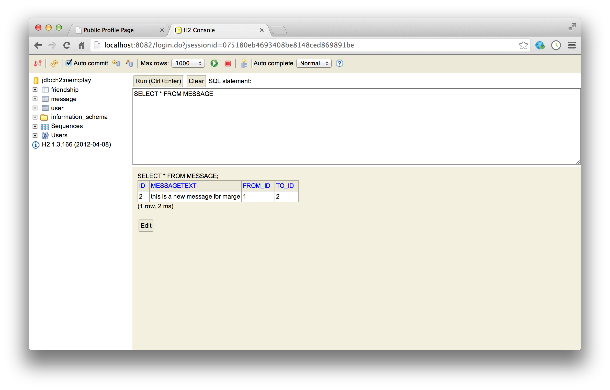

#sendMessage action II

Figuring out who sent the message is straightforward - it is whoever is currently logged in. Remember in the HomeProfile class we were able to get the current user by accessing the 'session':

~~~java
    String userId = session.get("logged_in_userid");
    User user = User.findById(Long.parseLong(userId));
~~~

We can use the same technique here in the UserProfile class:

~~~java
  public static void sendMessage(Long id, String messageText)
  {
    String userId = session.get("logged_in_userid");
    User fromUser = User.findById(Long.parseLong(userId));
    //...
  } 
~~~

'fromUser' now contains the user object for the sender of the message. Getting the user the message is intended for is easy - we have the id of that user as the parameter to the 'leaveMessage' function:

~~~java
  public static void sendMessage(Long id, String messageText)
  {
    String userId = session.get("logged_in_userid");
    User fromUser = User.findById(Long.parseLong(userId));
    User toUser = User.findById(id);
    //...
  } 
~~~

To test all of this, we can rework the log statement to print out the full names of the sender and receiver:

~~~java
  public static void sendMessage(Long id, String messageText)
  {
    String userId = session.get("logged_in_userid");
    User fromUser = User.findById(Long.parseLong(userId));
    User toUser = User.findById(id);
    
    Logger.info("Message from user " + 
        fromUser.firstName + ' ' + fromUser.lastName +" to " +
        toUser.firstName + ' ' + toUser.lastName +": " +
        messageText);    
    
    visit(id);
  } 
~~~

We can try this out now (saving everything) - and we should get a log message something like this when we leave a message:

~~~
13:54:35,798 INFO  ~ Message from user Homer Simpson to marge Simpson: test
~~~

Logging is useful for verifying that our implementation is on the right track. However, we do need to save this message to the database if we are going to be able to display message on the various profile pages.

We already have the 'Message' class designed to help with this. Now we introduce a new method in the User class to store new messages:

~~~java
  public void sendMessage (User to, String messageText)
  {
    Message message = new Message (this, to, messageText);
    outbox.add(message);
    to.inbox.add(message);
    message.save();
  }
~~~

We now include call to this method in the sendMessage action:

~~~java
  public static void sendMessage(Long id, String messageText)
  {
    String userId = session.get("logged_in_userid");
    User fromUser = User.findById(Long.parseLong(userId));
    User toUser = User.findById(id);
    
    Logger.info("Message from user " + 
        fromUser.firstName + ' ' + fromUser.lastName +" to " +
        toUser.firstName + ' ' + toUser.lastName +": " +
        messageText);    
    
    fromUser.sendMessage(toUser, messageText);
    visit(id);
  } 
~~~

Note the last statement - visit(id) - this is to make sure that once we have accepted the new message, we display the correct users profile page again. You should be able to try this our now - leave messages, and verify that the user profile page reloads successfully.

Note, however, that the messages don;t seem to be going anywhere, and our message text area is cleared every time we leave a message. We need to find a way of listing the messages on this page, on the right where we currently have a 'hard coded' message. 

Before doing that, though, we can still verify whether the messages are being saved to the database. This can be done via the '@db' interface we explored earlier. Browse to this url here:

- <http://localhost:9000/@db>

...and navigate to the messages table, running the default query:

