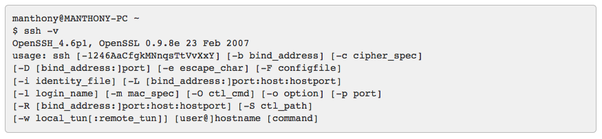

#SSH Keys

This section applies only if you do not have SSH keys on your computer. We shall explain shortly how you can check whether or not keys are present.

Official Heroku documentation on managing SSH keys is available [here](https://devcenter.heroku.com/articles/keys#adding-keys-to-heroku)

Your computer will communicate with Heroku using [Secure Shell](http://en.wikipedia.org/wiki/Secure_Shell) (SSH).

Here are brief instructions on how to check for the presence of SSH keys on your computer and to generate them if necessary.

Git Bash should have an SSH client. Verify this with the following command:

```
ssh -v
```
The response should be similar to this:



Check if you already have SSH keys by checking for the presence of the**.ssh** folder and if it exists, listing its contents:

```
ls -l ~/.ssh
```

If keys are present then the response should be something simiar to that shown in Figure 3:


If keys are not present then generate a set with this command:

```
ssh-keygen

```

Accept the default prompts and in particular when prompted for a password and to confirm the password simply hit the return key on both occasions but without typing any characters for the password.

- That is: do **not** password protect the keys.

Confirm that keys have been successfully generated by checking the contents of the *.ssh* folder which should be similar that shown in Figure 3 above.
