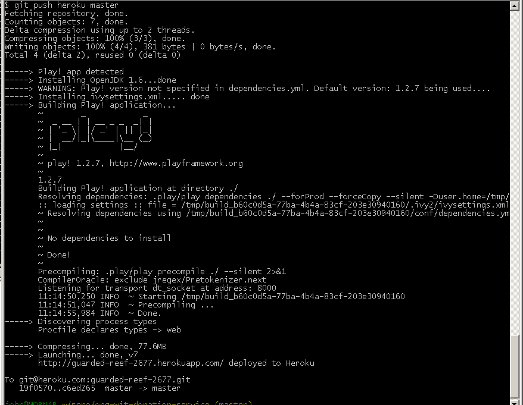

#Heroku repository

Create an account on [Heroku](http://www.heroku.com). Note carefully your login and password.

Download and install [Heroku Toolbelt for Windows](https://toolbelt.heroku.com). Close and reopen Git Bash following installation of the Toolbelt. 

Once installed, verify that the installation ok by typing 

~~~
heroku --version
~~~

The response should be something like:
    
~~~
heroku/toolbelt/3.12.1 (i386-mingw32) ruby/1.9.3
~~~

(The versions numbers my be different)

Login in to your heroku account from Git Bash

~~~
heroku login
~~~

You will be prompted for you email and password. Successful authentication will be confirmed. 

Next create a new blank app and repository on Heroku as follows:

~~~
heroku create
~~~

NB: The above command MUST BE ENTERED from within the project folder

The response will be something like this:

Notice the default name assigned by Heroku to the remote app.

Verify with the command 

~~~
git remote -v
~~~

and observe a response similar to that in Figure 2.

Now add your SSH keys to Heroku:

~~~
heroku keys:add
~~~

Finally, push the local repo to Heroku:

~~~
git push heroku master
~~~

This may take some time 
The response should be somewhat similar to that shown in Figure 4.

We shall now test the service: In the specific case of this lab we have been randomly assigned a remote Heroku repo named *guarded-reef-267.git*. The convention for construction a URI to access this repo or service can easily be deduced by studying the URI for this specific service:

~~~
http://guarded-reef-2677.herokuapp.com/api/users
~~~

The portions **/api/users** is determined by how we, the developers, wrote the application (*spacebook*). Notice where the actual name of the repo is located in the URI:

    - guarded-reef-2677

Copy this URI into a browser's navigation bar: unfortunately an application error is flagged. The reason for this is that we have not set up a suitable database on Heroku. We shall attend to this shortly.

###Changing name of Heroku app

We shall now change the Heroku-assigned name *guarded-reef-2677* to a more meaningful name *org-wit-spacebook-service-id* where **id** is your email address excluding @, periods, underscores and so on. For example john_doe@organs.com becomes johndoeorganscom. This is just a suggestion to ensure that the name you choose for the app on Heroku will be unique.

Run the following command within the Heroku terminal:

~~~
heroku apps:rename org-wit-spacebook-service-id
~~~

A typical response is shown in Figure 5:

